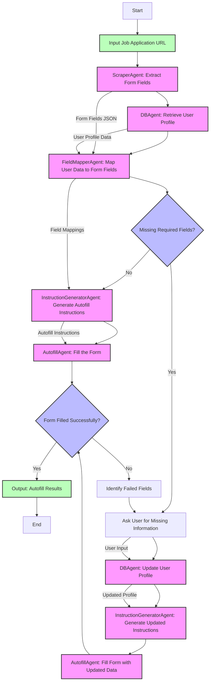

# Job Application Autofill Agent

## 1. Introduction (Yin)

The Job Application Autofill Agent is an multi-agent system designed to automate the job application process of filling out online application forms. The system will take users input about filling a job application form(url) and then efficiently handle the following tasks: receiving application links, scraping form data from the web, identifying required fields, query user database to get user data, mapping form fields to user data, auto filling forms, and lastly sending filled url back to user for review and submission. We willl also evaluate this multi-agent system based on 3 scopes: accuracy, tokens, and time using Phoenix.

### Project Purpose

Job applications often require repetitive data entry across multiple platforms, creating a tedious and time-consuming process for job seekers. This project aims to:

- **Reduce application time** from minutes to seconds per application
- **Increase application throughput** by enabling users to apply to more positions
- **Maintain accuracy** through intelligent field mapping and validation
- **Adapt to various form structures** across different application platforms

### Multiple Implementations

The project includes two implementations with same capabilities using different amount of agents:

1. **job_application_autofill_agent-version_1**: The core implementation with basic autofill capabilities and evaluation metrics with less agents where each agent can do more more than tasks
3. **job_application_autofill_agent_version_2**: An alternative implementation with similar core functionality and evaluation with more agents where each agent only is design to do one specific task

## 2. Framework

The project utilizes the `autogen` framework for orchestrating multi-agent workflows. This framework was selected for its powerful capabilities in creating and managing specialized AI agents that can collaborate to solve complex tasks.

### Key Advantages of AutoGen
- **Group Chat Management**: Efficient orchestration of multi-agent conversations
- **Modular Agent Architecture**: Enables the creation of specialized agents for specific tasks (scraping, mapping, autofill)
- **Flexible Communication Patterns**: Supports complex interaction patterns between agents
- **LLM Integration**: Seamless integration with language models like OpenAI's GPT-4
- **Function Calling**: Allows agents to execute specialized functions and tools

### Technical Architecture
The system is built on a multi-agent architecture where each agent specializes in a specific aspect of the form-filling process. The agents communicate through a group chat managed by the AutoGen framework, with an orchestrator agent directing the workflow.

## 3. Workflow

The job application autofill process follows a structured workflow, with variations between implementations. Below is a detailed diagram of the workflow, including the human-in-the-loop feedback mechanism:

## 4. Demo (Guo)
Demo of guo-job_application_autofill_agent:
[\[demo\]](https://drive.google.com/file/d/15rj9s4muDxmrJGYbJyqMJ0sx9UvMob0d/view?usp=drive_link)

## 5. Evaluation (Guo)
The project includes an evaluation module using the `Phoenix` framework, which tracks:
[\[demo with phoenix\]](https://drive.google.com/file/d/189aXgbpueAbjLMG5rcimhp1btU0NPinw/view?usp=drive_link)

## 6. (Optional) Implementations Comparison &&  Detailed Agent Architecture (Yin)

| Feature | guo-job_application_autofill_agent | human_in_the_loop | yin-job_application_autofill_agent |
|---------|-------------------------------------|-------------------|-----------------------------------|
| **Core Functionality** | Basic form scraping and autofill | Enhanced with human feedback | Similar to core implementation |
| **Human Interaction** | Limited | Extensive (asks for missing info) | Limited |
| **Profile Updates** | No | Yes (updates user profile with new data) | No |
| **Error Handling** | Basic | Advanced with recovery options | Basic |
| **Evaluation** | Phoenix tracing | Basic metrics | Similar to core |
| **Browser Control** | Playwright | Playwright with enhanced human-like behavior | Playwright |

The system consists of several specialized agents, each responsible for a specific part of the workflow:

### ScraperAgent
- **Role**: Extracts form fields and attributes from web pages
- **Responsibilities**:
  - Navigate to the provided URL
  - Extract all form fields (name, id, type, required status)
  - Identify special requirements for fields
  - Handle multi-page forms
  - Return structured data in JSON format

### DBAgent
- **Role**: Manages user profile data storage and retrieval
- **Responsibilities**:
  - Store and retrieve user profile information
  - Provide schema information about available user data
  - Update profiles with new information (in human-in-the-loop version)
  - Track feedback history for continuous improvement

### FieldMapperAgent
- **Role**: Maps user data to form fields using semantic matching
- **Responsibilities**:
  - Match user profile data to form fields
  - Handle different field types (text, select, checkbox)
  - Identify unmapped required fields
  - Generate structured mapping output

### InstructionGeneratorAgent
- **Role**: Generates detailed autofill instructions
- **Responsibilities**:
  - Convert field mappings to executable instructions
  - Generate appropriate selectors for each field
  - Determine correct fill methods based on field types
  - Handle special field types (dropdowns, checkboxes)

### AutofillAgent
- **Role**: Executes form filling using browser automation
- **Responsibilities**:
  - Navigate to the form URL
  - Fill each field using appropriate methods
  - Handle pagination in multi-page forms
  - Take screenshots of filled forms
  - Report success/failure for each field

### OrchestratorAgent
- **Role**: Coordinates the overall workflow
- **Responsibilities**:
  - Direct the conversation flow between agents
  - Track workflow state
  - Handle errors and exceptions
  - Present results to the user
  - Manage the human feedback loop (in human-in-the-loop version)

## 7. Challenges & Discussions (Guo)

1. LLM-Based Field Mapping vs. Hardcoded Patterns
LLMs can replace brittle rule-based systems with more flexible, adaptive solutions that can handle edge cases and novel inputs more effectively.

2. Parallel Processing and Information Dependencies in Multi-Agent Systems
This pattern of identifying which operations can run concurrently versus which have strict dependencies is crucial for designing effective multi-agent systems that balance speed with accuracy.

3. Database Schema Awareness
It is important for AI systems to have accurate models of the data structures they interact with, especially in systems that bridge between different data representations.

4. Multi-Agent Architecture Benefits
This architecture allows for independent optimization of components (e.g., improving the scraper without affecting the autofill logic) and enables different implementations to reuse components while modifying others to suit specific needs.

