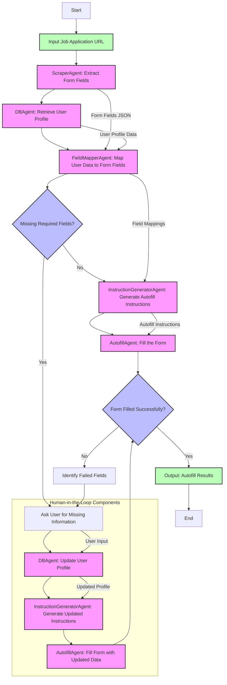

# Job Application Autofill Agent

## 1. Introduction (Yin)

The Job Application Autofill Agent is an advanced system designed to automate the job application process by intelligently filling out online application forms. It leverages AI-powered agents to extract form fields, map user data to appropriate fields, and automatically complete applications, significantly reducing the time and effort required by job seekers.

### Project Purpose

Job applications often require repetitive data entry across multiple platforms, creating a tedious and time-consuming process for job seekers. This project aims to:

- **Automate repetitive data entry** across multiple job application platforms
- **Reduce application time** from minutes to seconds per application
- **Increase application throughput** by enabling users to apply to more positions
- **Maintain accuracy** through intelligent field mapping and validation
- **Adapt to various form structures** across different application platforms

### Multiple Implementations

The project includes several implementations with different capabilities:

1. **guo-job_application_autofill_agent**: The core implementation with basic autofill capabilities and evaluation metrics
2. **human_in_the_loop**: An enhanced version that incorporates human feedback for missing fields and profile updates
3. **yin-job_application_autofill_agent**: An alternative implementation with similar core functionality

## 2. Framework (Yin)

The project utilizes the `autogen` framework for orchestrating multi-agent workflows. This framework was selected for its powerful capabilities in creating and managing specialized AI agents that can collaborate to solve complex tasks.

### Key Advantages of AutoGen

- **Modular Agent Architecture**: Enables the creation of specialized agents for specific tasks (scraping, mapping, autofill)
- **Flexible Communication Patterns**: Supports complex interaction patterns between agents
- **LLM Integration**: Seamless integration with language models like OpenAI's GPT-4
- **Group Chat Management**: Efficient orchestration of multi-agent conversations
- **Function Calling**: Allows agents to execute specialized functions and tools

### Technical Architecture

The system is built on a multi-agent architecture where each agent specializes in a specific aspect of the form-filling process. The agents communicate through a group chat managed by the AutoGen framework, with an orchestrator agent directing the workflow.

## 3. Workflow (Yin)

The job application autofill process follows a structured workflow, with variations between implementations. Below is a detailed diagram of the workflow, including the human-in-the-loop feedback mechanism:

## 4. Demo (Guo)
Demo of guo-job_application_autofill_agent:
[video uploaded]

## 5. Evaluation (Guo)
The project includes an evaluation module using the `Phoenix` framework, which tracks:
[video uploaded]

## 6. (Optional) Implementations Comparison &&  Detailed Agent Architecture (Yin)

| Feature | guo-job_application_autofill_agent | human_in_the_loop | yin-job_application_autofill_agent |
|---------|-------------------------------------|-------------------|-----------------------------------|
| **Core Functionality** | Basic form scraping and autofill | Enhanced with human feedback | Similar to core implementation |
| **Human Interaction** | Limited | Extensive (asks for missing info) | Limited |
| **Profile Updates** | No | Yes (updates user profile with new data) | No |
| **Error Handling** | Basic | Advanced with recovery options | Basic |
| **Evaluation** | Phoenix tracing | Basic metrics | Similar to core |
| **Browser Control** | Playwright | Playwright with enhanced human-like behavior | Playwright |

The system consists of several specialized agents, each responsible for a specific part of the workflow:

### ScraperAgent
- **Role**: Extracts form fields and attributes from web pages
- **Responsibilities**:
  - Navigate to the provided URL
  - Extract all form fields (name, id, type, required status)
  - Identify special requirements for fields
  - Handle multi-page forms
  - Return structured data in JSON format

### DBAgent
- **Role**: Manages user profile data storage and retrieval
- **Responsibilities**:
  - Store and retrieve user profile information
  - Provide schema information about available user data
  - Update profiles with new information (in human-in-the-loop version)
  - Track feedback history for continuous improvement

### FieldMapperAgent
- **Role**: Maps user data to form fields using semantic matching
- **Responsibilities**:
  - Match user profile data to form fields
  - Handle different field types (text, select, checkbox)
  - Identify unmapped required fields
  - Generate structured mapping output

### InstructionGeneratorAgent
- **Role**: Generates detailed autofill instructions
- **Responsibilities**:
  - Convert field mappings to executable instructions
  - Generate appropriate selectors for each field
  - Determine correct fill methods based on field types
  - Handle special field types (dropdowns, checkboxes)

### AutofillAgent
- **Role**: Executes form filling using browser automation
- **Responsibilities**:
  - Navigate to the form URL
  - Fill each field using appropriate methods
  - Handle pagination in multi-page forms
  - Take screenshots of filled forms
  - Report success/failure for each field

### OrchestratorAgent
- **Role**: Coordinates the overall workflow
- **Responsibilities**:
  - Direct the conversation flow between agents
  - Track workflow state
  - Handle errors and exceptions
  - Present results to the user
  - Manage the human feedback loop (in human-in-the-loop version)

## 7. Challenges & Discussions (Guo)

1. LLM-Based Field Mapping vs. Hardcoded Patterns
The transition from hardcoded field mapping patterns to LLM-based analysis represents a fundamental shift in approach. Rather than relying on predefined regex patterns that require maintenance and updates, the system now leverages specialized agents (FormAnalyzerAgent, QueryGeneratorAgent) that can intelligently analyze form structures and adapt to new field types without code changes. This demonstrates how LLMs can replace brittle rule-based systems with more flexible, adaptive solutions that can handle edge cases and novel inputs more effectively.

2. Parallel Processing and Information Dependencies in Multi-Agent Systems
The workflow redesign highlighted the importance of understanding information dependencies between agents. By processing the form analysis and database schema retrieval in parallel, then ensuring the QueryGeneratorAgent has access to both before generating queries, we created a more efficient workflow while maintaining data integrity. This pattern of identifying which operations can run concurrently versus which have strict dependencies is crucial for designing effective multi-agent systems that balance speed with accuracy.

3. Database Schema Awareness for Accurate Query Generation
A critical insight was recognizing that the QueryGeneratorAgent needed explicit access to the actual database schema to generate valid queries. Without this knowledge, the agent was generating queries with field names that didn't match the database structure (e.g., requesting "full_name" when the database stored "personal.first_name" and "personal.last_name"). This highlights how important it is for AI systems to have accurate models of the data structures they interact with, especially in systems that bridge between different data representations.

4. Human-AI Collaboration Balance: 
The human-in-the-loop implementation reveals a critical insight about form automation - pure automation often fails with complex or unusual form fields. The architectural decision to incorporate human feedback at strategic points (specifically after field mapping and form filling attempts) creates a system that combines AI efficiency with human judgment. This hybrid approach achieves higher completion rates while continuously improving the system through profile updates.

5. Field Mapping Complexity: 
The semantic matching between user profile data and diverse form fields emerges as the core technical challenge. Forms use inconsistent naming conventions, field types, and structures across different websites. The project's approach of combining direct matching, partial matching, and flattening nested user data structures demonstrates how complex this seemingly straightforward problem becomes in real-world applications.

6. Multi-Agent Architecture Benefits: 
The decision to implement specialized agents rather than a monolithic solution provides significant advantages in system evolution. Each agent focuses on a specific task (scraping, mapping, filling) with clear interfaces between them. This architecture allows for independent optimization of components (e.g., improving the scraper without affecting the autofill logic) and enables different implementations to reuse components while modifying others to suit specific needs.

Data Structure Consistency Between Agents

The most challenging aspect of the multi-agent system was ensuring consistent data structures between agents. When one agent (FieldMapperAgent) produced output with "matched_fields" but another agent (InstructionGeneratorAgent) expected "form_fields", it caused cascading failures. This highlights the critical importance of establishing strict contracts between agents in a pipeline and implementing robust validation. Using Pydantic models for validation proved essential, but explicit instructions in each agent's system message was equally important to prevent data transformation issues.

Human-in-the-Loop Workflow Design

The implementation revealed that human-in-the-loop systems require careful orchestration of when and how to involve human input. The project demonstrated two distinct approaches: using a dedicated FeedbackAgent versus having the UserProxyAgent directly handle missing information. The simpler direct approach proved more effective, showing that sometimes reducing intermediary agents can lead to more reliable systems. This suggests that human-in-the-loop systems should be designed with minimal handoffs when human input is required.

Explicit vs. Implicit Agent Instructions

The project demonstrated that LLM-based agents require extremely explicit instructions about data formats and workflows. Simply describing the expected behavior wasn't sufficient - we needed to include examples, warnings about what NOT to do, and critical formatting requirements. This suggests that when designing multi-agent systems, developers should anticipate that agents may "creatively misinterpret" instructions and proactively provide guardrails through explicit examples and counter-examples in system messages.